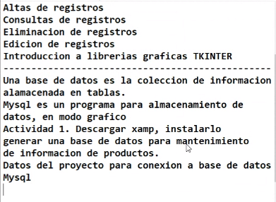
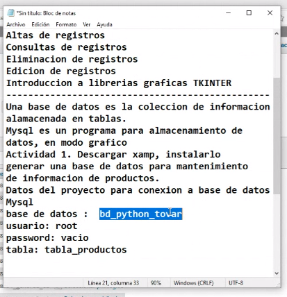

COMO GUARDAR LOS DATOS EN GITHUB PARA TENERLO EN CUENTA
-git status
-git add .
-git commit -m "texto"
-git push --principal

SESION 1 CURSO ESPECIAL PYTHON
4 SESIONES
-MARTES 02-ENERO - VIERNES 05-ENERO

1.- INSTALACION DE HERRAMIENTAS
2.- PYTHON 12
3.- VSCODE 

-------------------------------
sintaxis y elementos
variables
tipos de dato int, float, str
operadores aritmeticos, relativos, logicos
estructuras de control, if, while, for
tratamiento de errores try catch
funciones base

CREACION DE LA TABLA EN EL SERVIDOR O XAMPP EN SU DEBIDO CASO

CREATE TABLE productos(
	idProducto int(10) PRIMARY KEY,
    nombre varchar(30),
    descripcion varchar(30),
    cantidad int(10),
    precio float(8,2)
);
